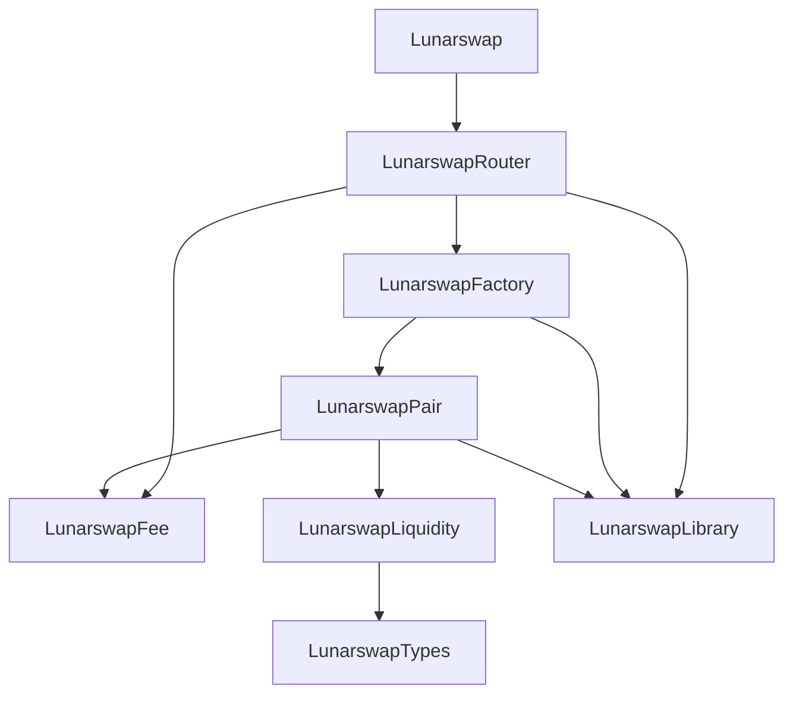

# Lunarswap

This document provides a visual representation of the module dependencies in the Lunarswap protocol, focusing on the initialize circuits and their relationships.

## Initialize Circuit Dependency Chain

The initialize flow follows this chain:
```
Lunarswap (constructor)
  → LunarswapRouter.initialize
    → LunarswapFactory.initialize
      → LunarswapPair.initialize
        → LunarswapLiquidity.initialize
    → LunarswapFee.initialize
```

## Complete Module Dependency Graph



## Module Descriptions

- **Lunarswap**: Main entry point contract that initializes the protocol
- **LunarswapRouter**: User-facing interface for liquidity operations and swaps
- **LunarswapFactory**: Manages pair creation and storage
- **LunarswapPair**: Core trading pair logic for liquidity and swaps
- **LunarswapLiquidity**: LP token minting, burning, and supply tracking
- **LunarswapFee**: Protocol fee management and distribution
- **LunarswapLibrary**: Utility functions for math, sorting, and pair identification
- **LunarswapTypes**: Type definitions (PairId, ReserveId) to avoid circular dependencies

## Initialize Circuit Details

### Lunarswap Constructor
- **Location**: `Lunarswap.compact` line 106-108
- **Calls**: `LunarswapRouter_initialize(nonce, name, symbol, decimals, ownPublicKey())`

### LunarswapRouter.initialize
- **Location**: `LunarswapRouter.compact` line 83-93
- **Circuit Info**: k=11, rows=2000
- **Calls**:
  - `LunarswapFactory_initialize(nonce, name, symbol, decimals)`
  - `LunarswapFee_initialize(feeToSetter)`

### LunarswapFactory.initialize
- **Location**: `LunarswapFactory.compact` line 82-89
- **Circuit Info**: k=11, rows=1200
- **Calls**: `LunarswapPair_initialize(nonce, name, symbol, decimals)`

### LunarswapPair.initialize
- **Location**: `LunarswapPair.compact` line 98-105
- **Circuit Info**: k=11, rows=500
- **Calls**: `LunarswapLiquidity_initialize(nonce, name, symbol, decimals)`

### LunarswapLiquidity.initialize
- **Location**: `LunarswapLiquidity.compact` line 111-122
- **Initializes**: nonce, name, symbol, decimals ledgers

### LunarswapFee.initialize
- **Location**: `LunarswapFee.compact` line 54-56
- **Initializes**: feeToSetter ledger
