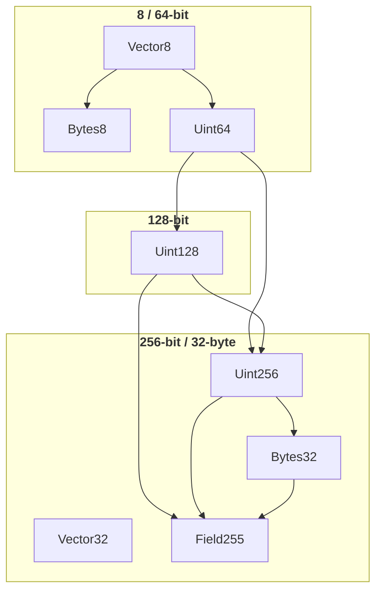

# `@openzeppelin/midnight-apps-contracts/math`

A comprehensive mathematical operations library for Midnight Network smart contracts, providing efficient and secure arithmetic operations for various integer types.

## Overview

This package provides mathematical contract operations for the Midnight Network, including:

- **Uint64, Uint128 and Uint256 arithmetic operations** with overflow protection
- **Square root calculations** using efficient algorithms
- **Division operations** with quotient and remainder results
- **Witness-based computations** for off-chain calculations and circuit verification.
- **Type-safe interfaces** for all mathematical operations

### Module Dependency Diagram

> Arrows point from dependency to dependent (read as "is used by").
> Shared struct types `U128` and `U256` (from Types) are omitted for clarity.



## Features

### Supported Integer Types
- `Uint<64>` - 64-bit unsigned integers
- `Uint<128>` - 128-bit unsigned integers
- `Uint<256>` - 256-bit unsigned integers

### Mathematical Operations
- **Basic Arithmetic**: Addition, subtraction, multiplication, division
- **Advanced Operations**: Square root, modulo, power operations
- **Safe Operations**: All operations include overflow/underflow protection
- **Witness Functions**: Off-chain computation capabilities for complex operations

### Key Components

#### Core Contracts
- `Uint64.compact` - 64-bit mathematical operations
- `Uint128.compact` - 128-bit mathematical operations
- `Uint256.compact` - 256-bit mathematical operations
- `Bytes32.compact` - Byte array operations
- `Field255.compact` - Field arithmetic operations
- `Vector8.compact` - Vector<8, Uint<8>> to Uint<64> / Bytes<8> conversions
- `Vector32.compact` - Vector<32, Uint<8>> to U256 / Bytes<32> conversions
- `Bytes8.compact` - Bytes<8> to Uint<64> / Vector<8, Uint<8>> conversions

#### Utility Functions
- `sqrtBigint()` - Efficient square root calculation using Newton-Raphson method
- `consts.ts` - Mathematical constants

#### Witness Implementations
- Off-chain computation for division and square root operations
- Type-safe witness contexts
- Private state management

## Installation

```bash
pnpm add @openzeppelin/midnight-apps-contracts
```

## Usage

### Example: Contract Using Multiple Math Modules

Consider a Compact contract that imports `Uint64`, `Uint128`, `Uint256`, and `Bytes32` modules:

```ts
// MyContract.compact (Top-level contract)

import { div as divU64, sqrt as sqrtU64 } from "./node_modules/@openzeppelin/midnight-apps-contracts/math/Uint64";
import { mul, div, sqrt } from "./node_modules/@openzeppelin/midnight-apps-contracts/math/Uint128";
import { toBytes } from "./node_modules/@openzeppelin/midnight-apps-contracts/math/Uint256";
import { lt } from "./node_modules/@openzeppelin/midnight-apps-contracts/math/Bytes32";

// Computes a weighted average using 64-bit arithmetic
export circuit weightedAverage(value: Uint<64>, weight: Uint<64>, total: Uint<64>): Uint<64> {
    // Divide value by total (witness-based division)
    const ratio = divU64(value, total);

    // Compute square root of weight (witness-based sqrt)
    const sqrtWeight = sqrtU64(weight);

    // Return the weighted result
    return ratio.quotient * sqrtWeight;
}

// Computes (a * b) / c and returns the square root as Bytes<32>
export circuit computeAndConvert(a: Uint<128>, b: Uint<128>, c: Uint<128>): Bytes<32> {
    // Multiply a * b (returns U256 to handle overflow)
    const product = mul(a, b);

    // Divide product by c (witness-based division)
    const quotient = div(product.low, c);

    // Compute square root of the quotient (witness-based sqrt)
    const sqrtResult = sqrt(quotient);

    // Multiply sqrt result to get U256 for byte conversion
    const finalProduct = mul(sqrtResult as Uint<128>, sqrtResult as Uint<128>);

    // Convert U256 to Bytes<32> using little-endian ordering
    return toBytes(finalProduct);
}

// Compares two byte arrays and returns true if a < b
export circuit compareBytes(a: Bytes<32>, b: Bytes<32>): Boolean {
    return lt(a, b);
}
```

When you compile this contract, the generated `Witnesses` type will be a **combination** of all witness functions required by the imported modules:

```typescript
// Generated in artifacts/my-contract/contract/index.d.ts
export type Witnesses<PS> = {
  // From Uint64 module (used by div and sqrt circuits)
  wit_divU64(context: WitnessContext<Ledger, PS>, a: bigint, b: bigint): [PS, DivResultU64];
  wit_sqrtU64(context: WitnessContext<Ledger, PS>, radicand: bigint): [PS, bigint];

  // From Uint128 module (used by div and sqrt circuits)
  wit_divUint128(context: WitnessContext<Ledger, PS>, a: bigint, b: bigint): [PS, DivResultU128];
  wit_sqrtU128(context: WitnessContext<Ledger, PS>, radicand: U128): [PS, bigint];
}
```

> **Note:** The `mul` and `toBytes` circuits are pure and don't require witnesses. Only `divU64`, `sqrtU64`, `div`, and `sqrt` need witnesses for their off-chain computations.

To implement the witnesses, import the required functions from the library and combine them:

```typescript
import type { Witnesses } from './artifacts/my-contract/contract/index.js';

// Import witness functions for Uint64
import { wit_divU64 } from '@openzeppelin/midnight-apps-contracts/math/witnesses/wit_divU64';
import { wit_sqrtU64 } from '@openzeppelin/midnight-apps-contracts/math/witnesses/wit_sqrtU64';

// Import witness functions for Uint128
import { wit_divUint128 } from '@openzeppelin/midnight-apps-contracts/math/witnesses/wit_divUint128';
import { wit_sqrtU128 } from '@openzeppelin/midnight-apps-contracts/math/witnesses/wit_sqrtU128';

type MyPrivateState = Record<string, never>;

export const MyContractWitnesses = (): Witnesses<MyPrivateState> => ({
  // Uint64 witnesses (required by div and sqrt circuits)
  wit_divU64(_context, a, b) {
    return [{}, wit_divU64(a, b)];
  },
  wit_sqrtU64(_context, radicand) {
    return [{}, wit_sqrtU64(radicand)];
  },

  // Uint128 witnesses (required by div and sqrt circuits)
  wit_divUint128(_context, a, b) {
    return [{}, wit_divUint128(a, b)];
  },
  wit_sqrtU128(_context, radicand) {
    return [{}, wit_sqrtU128(radicand)];
  },
});

// Use with contract instantiation
const witnesses = MyContractWitnesses();
const contract = new Contract(witnesses);
```

### Implementing Witnesses for Your Contract

When you import a math module in your Compact contract, you need to provide witness implementations for the witness functions declared in that module. This library provides **recommended implementations** for all witness functions that ensure circuit constraints pass successfully.

> **Note:** You can build your own witness implementations if needed, but the library-provided implementations are tested and guaranteed to satisfy the circuit constraints.

#### Step 1: Import the Witnesses Type from Your Contract

When you compile your Compact contract that uses math modules, the generated artifacts include a `Witnesses` type that defines the required witness functions:

```typescript
import type { Witnesses } from './artifacts/your-contract/contract/index.js';
```

#### Step 2: Import the Witness Functions from the Library

Import the pure witness functions you need:

```typescript
// For Uint64 operations
import { wit_sqrtU64 } from '@openzeppelin/midnight-apps-contracts/math/witnesses/wit_sqrtU64';
import { wit_divU64 } from '@openzeppelin/midnight-apps-contracts/math/witnesses/wit_divU64';

// For Uint128 operations
import { wit_sqrtU128 } from '@openzeppelin/midnight-apps-contracts/math/witnesses/wit_sqrtU128';
import { wit_divU128 } from '@openzeppelin/midnight-apps-contracts/math/witnesses/wit_divU128';
import { wit_divUint128 } from '@openzeppelin/midnight-apps-contracts/math/witnesses/wit_divUint128';

```

#### Step 3: Create Your Witnesses Object

Implement the `Witnesses` type by wrapping the library functions with your private state:

```typescript
import type { Witnesses } from './artifacts/your-contract/contract/index.js';
import { wit_sqrtU64 } from '@openzeppelin/midnight-apps-contracts/math/witnesses/wit_sqrtU64';
import { wit_divU64 } from '@openzeppelin/midnight-apps-contracts/math/witnesses/wit_divU64';

// Define your private state type
type MyPrivateState = Record<string, never>; // or your actual private state

// Create the witnesses object
const createWitnesses = (): Witnesses<MyPrivateState> => ({
  // Wrap each library function with context handling
  wit_sqrtU64(_context, radicand) {
    return [{}, wit_sqrtU64(radicand)];
  },

  wit_divU64(_context, dividend, divisor) {
    return [{}, wit_divU64(dividend, divisor)];
  },
});
```

### Available Witness Functions

| Function | Module | Description | Input | Output |
|----------|--------|-------------|-------|--------|
| `wit_sqrtU64` | Uint64 | Square root of 64-bit integer | `bigint` | `bigint` |
| `wit_divU64` | Uint64 | Division with remainder | `bigint, bigint` | `DivResultU64` |
| `wit_sqrtU128` | Uint128 | Square root of U128 struct | `U128` | `bigint` |
| `wit_divU128` | Uint128 | Division of U128 structs | `U128, U128` | `DivResultU128` |
| `wit_divUint128` | Uint128/Uint256 | Division of Uint<128> values | `bigint, bigint` | `DivResultU128` |
| `wit_unpackBytes` | Pack / Bytes8 / Bytes32 | Unpack bytes to byte vector | `Uint8Array` | `bigint[]` |

### Types

The library exports helper types for working with large integers:

```typescript
import type {
  U128,
  U256,
  DivResultU64,
  DivResultU128,
  DivResultU256
} from '@openzeppelin/midnight-apps-contracts/math/witnesses/types';

// U128: { low: bigint, high: bigint }
// U256: { low: U128, high: U128 }
// DivResultU64: { quotient: bigint, remainder: bigint }
// DivResultU128: { quotient: U128, remainder: U128 }
// DivResultU256: { quotient: U256, remainder: U256 }
```

### Conversion Helpers

```typescript
import {
  toU128,
  toBigint,
  toU256
} from '@openzeppelin/midnight-apps-contracts/math/witnesses/types';

// Convert bigint to U128 struct
const u128Value = toU128(1000n);

// Convert U128 struct back to bigint
const bigintValue = toBigint(u128Value);

// Convert bigint to U256 struct
const u256Value = toU256(1000n);
```

## API Reference

### Witness Functions

These are pure functions that perform the computation without any context or private state handling. They are designed to be wrapped with your contract's context handling.

#### `wit_sqrtU64(radicand: bigint): bigint`
Computes the square root of a 64-bit unsigned integer.

#### `wit_divU64(dividend: bigint, divisor: bigint): DivResultU64`
Computes division with quotient and remainder for 64-bit unsigned integers.

#### `wit_sqrtU128(radicand: U128): bigint`
Computes the square root of a 128-bit unsigned integer (U128 struct).

#### `wit_divU128(a: U128, b: U128): DivResultU128`
Computes division with quotient and remainder for U128 structs.

#### `wit_divUint128(a: bigint, b: bigint): DivResultU128`
Computes division with quotient and remainder for Uint<128> values (bigint), returning U128 structs.

### Types

#### `U128`
Represents a 128-bit unsigned integer as two 64-bit components:
```typescript
type U128 = { low: bigint; high: bigint };
```

#### `U256`
Represents a 256-bit unsigned integer as two U128 components:
```typescript
type U256 = { low: U128; high: U128 };
```

#### `DivResultU64`
Division result for 64-bit operations:
```typescript
type DivResultU64 = { quotient: bigint; remainder: bigint };
```

#### `DivResultU128`
Division result for 128-bit operations:
```typescript
type DivResultU128 = { quotient: U128; remainder: U128 };
```

#### `DivResultU256`
Division result for 256-bit operations:
```typescript
type DivResultU256 = { quotient: U256; remainder: U256 };
```

### Conversion Helpers

#### `toU128(value: bigint): U128`
Converts a bigint to a U128 struct.

#### `toBigint(value: U128): bigint`
Converts a U128 struct back to a bigint.

#### `toU256(value: bigint): U256`
Converts a bigint to a U256 struct.

## Development

### Prerequisites
- Node.js 18+
- pnpm 10.4.1+
- TypeScript 5.8+

### Setup
```bash
pnpm install
```

### Available Scripts

```bash
# Build the package
pnpm build

# Run tests
pnpm test

# Type checking
pnpm types

# Format code
pnpm fmt

# Lint code
pnpm lint

# Fix linting issues
pnpm lint:fix

# Pre-commit checks
pnpm precommit
```

### Testing

The package includes comprehensive tests for all mathematical operations:

```bash
# Run all tests
pnpm test

# Run tests with console trace
pnpm test --printConsoleTrace
```

## Architecture

### Contract Structure
```
src/math/
├── Uint64.compact           # 64-bit mathematical operations
├── Uint128.compact          # 128-bit mathematical operations
├── Uint256.compact          # 256-bit mathematical operations
├── Bytes32.compact          # Byte array operations
├── Field255.compact         # Field arithmetic operations
├── Vector8.compact          # Vector<8> to Uint64 / Bytes<8>
├── Vector32.compact         # Vector<32> to U256 / Bytes<32>
├── Bytes8.compact           # Bytes<8> to Uint64 / Vector<8>
├── types/                   # Compact type definitions
│   └── Types.compact        # U128 and U256 struct types
├── witnesses/               # Pure witness function implementations
│   ├── types.ts             # Shared types (U128, U256, DivResult*)
│   ├── wit_sqrtU64.ts       # Square root for Uint64
│   ├── wit_divU64.ts        # Division for Uint64
│   ├── wit_sqrtU128.ts      # Square root for Uint128
│   ├── wit_divU128.ts       # Division for Uint128
│   ├── wit_divUint128.ts    # Division for Uint<128> (shared)
│   └── wit_unpackBytes.ts   # Unpack Bytes to Vector (Pack module)
├── utils/                   # Utility functions
│   ├── sqrtBigint.ts        # Newton-Raphson square root
│   └── consts.ts            # Mathematical constants
└── test/                    # Test files and mocks
```

## Circuit Information

The following table shows the constraint counts and circuit sizes for each mathematical operation:

### Uint64 Operations
| Operation | Circuit Name | K (Constraint Degree) | Rows |
|-----------|--------------|----------------------|------|
| Division | `div` | 10 | 240 |
| Division with Remainder | `divRem` | 10 | 277 |
| Remainder | `rem` | 10 | 240 |
| Square Root | `sqrt` | 10 | 122 |
| Is Multiple | `isMultiple` | 10 | 243 |

### Uint128 Operations
| Operation | Circuit Name | K (Constraint Degree) | Rows |
|-----------|--------------|----------------------|------|
| Addition | `add` | 10 | 575 |
| Addition (U128) | `addU128` | 10 | 451 |
| Division | `div` | 12 | 2,778 |
| Division with Remainder | `divRem` | 12 | 2,819 |
| Division (U128) | `divU128` | 12 | 2,641 |
| Division with Remainder (U128) | `divRemU128` | 12 | 2,695 |
| Multiplication | `mul` | 11 | 1,874 |
| Multiplication (U128) | `mulU128` | 11 | 1,750 |
| Multiplication (Checked) | `mulChecked` | 11 | 1,876 |
| Multiplication (Checked U128) | `mulCheckedU128` | 11 | 1,752 |
| Remainder | `rem` | 12 | 2,778 |
| Is Multiple | `isMultiple` | 12 | 2,759 |
| Is Multiple (U128) | `isMultipleU128` | 12 | 2,635 |

### Uint256 Operations

| Operation | Circuit Name | K (Constraint Degree) | Rows |
|-----------|--------------|----------------------|------|
| Addition | `add` | 11 | 1,305 |
| Subtraction | `sub` | 11 | 1,271 |
| Division | `div` | 14 | 10,912 |
| Division with Remainder | `divRem` | 14 | 11,020 |
| Multiplication | `mul` | 14 | 9,249 |
| Remainder | `rem` | 14 | 10,912 |
| Square Root | `sqrt` | 14 | 11,693 |
| Is Multiple | `isMultiple` | 14 | 10,897 |
| From U256 | `fromU256` | 10 | 816 |
| To U256 | `toU256` | 10 | 739 |

### Field255 Operations
| Operation | Circuit Name | K (Constraint Degree) | Rows |
|-----------|--------------|----------------------|------|
| Addition | `add` | 12 | 3,008 |
| Multiplication | `mul` | 14 | 10,956 |
| Division | `div` | 14 | 12,623 |
| Division with Remainder | `divRem` | 14 | 12,101 |
| Equality | `eq` | 11 | 1,410 |
| Greater Than | `gt` | 11 | 1,495 |
| Greater Than or Equal | `gte` | 11 | 1,518 |
| Less Than | `lt` | 11 | 1,495 |
| Less Than or Equal | `lte` | 11 | 1,518 |
| Is Zero | `isZero` | 10 | 724 |
| From Field | `fromField` | 10 | 739 |
| Maximum | `max` | 12 | 2,208 |
| Minimum | `min` | 12 | 2,208 |

### Bytes32 Operations
| Operation | Circuit Name | K (Constraint Degree) | Rows |
|-----------|--------------|----------------------|------|
| Greater Than | `gt` | 12 | 2,639 |
| Greater Than or Equal | `gte` | 12 | 2,643 |
| Less Than | `lt` | 12 | 2,639 |
| Less Than or Equal | `lte` | 12 | 2,643 |

### Circuit Complexity Notes

- **K (Constraint Degree)**: Represents the maximum degree of constraints in the circuit
- **Rows**: Number of constraint rows in the circuit
- **Higher K values** indicate more complex constraints but potentially better performance
- **More rows** generally mean larger proof sizes and longer verification times
- **U64 operations** are the most efficient with the lowest constraint counts
- **U256 operations** require the most constraints due to larger bit widths
- **Field operations** have moderate complexity but provide field arithmetic guarantees

### Key Design Principles

1. **Type Safety**: All operations are fully typed with TypeScript
2. **Overflow Protection**: Built-in protection against integer overflow
3. **Efficiency**: Optimized algorithms for large number operations
4. **Witness Pattern**: Off-chain computation for complex operations
5. **Modularity**: Separate contracts for different integer sizes

## Contributing

1. Fork the repository
2. Create a feature branch
3. Make your changes
4. Add tests for new functionality
5. Run the test suite
6. Submit a pull request

## License

ISC License - see package.json for details.

## Related Packages

- `@openzeppelin/midnight-apps-compact` - Core Compact framework
- `@midnight-ntwrk/compact-runtime` - Runtime utilities
- `@midnight-ntwrk/zswap` - ZK-SNARK operations
