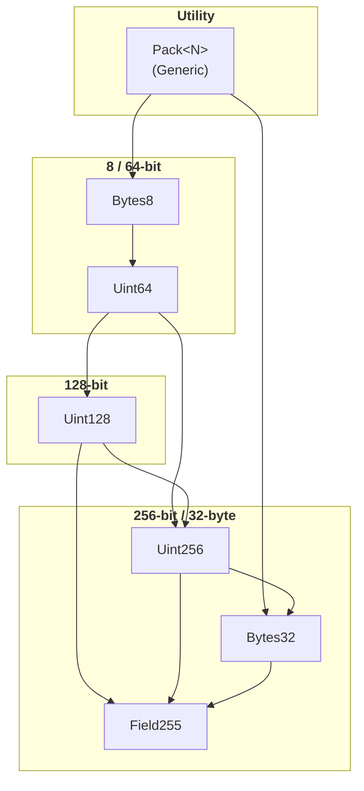

# `@openzeppelin/midnight-apps-contracts/math`

A comprehensive mathematical operations library for Midnight Network smart contracts, providing efficient and secure arithmetic operations for various integer types.

## Overview

This package provides mathematical contract operations for the Midnight Network, including:

- **Uint64, Uint128 and Uint256 arithmetic operations** with overflow protection
- **Square root calculations** using efficient algorithms
- **Division operations** with quotient and remainder results
- **Witness-based computations** for off-chain calculations and circuit verification.
- **Type-safe interfaces** for all mathematical operations

### Module Dependency Diagram

> Arrows point from dependency to dependent (read as "is used by").
> Shared struct types `U128` and `U256` (from Types) are omitted for clarity.


```mermaid
graph TD
    subgraph "<b>Utility</b>"
        Pack["Pack&lt;N&gt;<br/>(Generic)"]
    end

    subgraph "<b>8 / 64-bit</b>"
        Bytes8
        Uint64
    end

    subgraph "<b>128-bit</b>"
        Uint128
    end

    subgraph "<b>256-bit / 32-byte</b>"
        Uint256
        Bytes32
        Field255
    end

    Pack --> Bytes8
    Pack --> Bytes32
    Bytes8 --> Uint64
    Uint64 --> Uint128
    Uint64 --> Uint256
    Uint128 --> Uint256
    Uint128 --> Field255
    Uint256 --> Bytes32
    Uint256 --> Field255
    Bytes32 --> Field255
```

## Features

### Supported Integer Types
- `Uint<64>` - 64-bit unsigned integers
- `Uint<128>` - 128-bit unsigned integers
- `Uint<256>` - 256-bit unsigned integers

### Mathematical Operations
- **Basic Arithmetic**: Addition, subtraction, multiplication, division
- **Advanced Operations**: Square root, modulo, power operations
- **Safe Operations**: All operations include overflow/underflow protection
- **Witness Functions**: Off-chain computation capabilities for complex operations

### Key Components

#### Core Modules

**Arithmetic Operations:**
- `Uint64.compact` - 64-bit unsigned integer arithmetic with division, multiplication, square root, and utility functions
- `Uint128.compact` - 128-bit unsigned integer operations using limb-based U128 struct representation
- `Uint256.compact` - 256-bit unsigned integer operations using nested U128 limbs for efficient comparisons

**Byte & Field Operations:**
- `Bytes8.compact` - Conversions between Bytes<8>, Vector<8, Uint<8>>, and Uint<64> (little-endian)
- `Bytes32.compact` - Conversions and comparisons for Bytes<32> using U256 representation
- `Field255.compact` - BLS12-381 scalar field arithmetic operations using Bytes<32> as intermediate

**Utility Modules:**
- `Pack<N>.compact` - Generic packing/unpacking for Vector<N, Uint<8>> ↔ Bytes<N> (parameterized by size N)

## Usage

### Example: Contract Using Multiple Math Modules

Consider a Compact contract that imports `Uint64`, `Uint128`, `Uint256`, and `Bytes32` modules:

```ts
// MyContract.compact (Top-level contract)

import { div as divU64, sqrt as sqrtU64 } from "./node_modules/@openzeppelin/midnight-apps-contracts/math/Uint64";
import { mul, div, sqrt } from "./node_modules/@openzeppelin/midnight-apps-contracts/math/Uint128";
import { toBytes } from "./node_modules/@openzeppelin/midnight-apps-contracts/math/Uint256";
import { lt } from "./node_modules/@openzeppelin/midnight-apps-contracts/math/Bytes32";

// Computes a weighted average using 64-bit arithmetic
export circuit weightedAverage(value: Uint<64>, weight: Uint<64>, total: Uint<64>): Uint<64> {
    // Divide value by total (witness-based division)
    const ratio = divU64(value, total);

    // Compute square root of weight (witness-based sqrt)
    const sqrtWeight = sqrtU64(weight);

    // Return the weighted result
    return ratio.quotient * sqrtWeight;
}

// Computes (a * b) / c and returns the square root as Bytes<32>
export circuit computeAndConvert(a: Uint<128>, b: Uint<128>, c: Uint<128>): Bytes<32> {
    // Multiply a * b (returns U256 to handle overflow)
    const product = mul(a, b);

    // Divide product by c (witness-based division)
    const quotient = div(product.low, c);

    // Compute square root of the quotient (witness-based sqrt)
    const sqrtResult = sqrt(quotient);

    // Multiply sqrt result to get U256 for byte conversion
    const finalProduct = mul(sqrtResult as Uint<128>, sqrtResult as Uint<128>);

    // Convert U256 to Bytes<32> using little-endian ordering
    return toBytes(finalProduct);
}

// Compares two byte arrays and returns true if a < b
export circuit compareBytes(a: Bytes<32>, b: Bytes<32>): Boolean {
    return lt(a, b);
}
```

When you compile this contract, the generated `Witnesses` type will be a **combination** of all witness functions required by the imported modules:

```typescript
// Generated in artifacts/my-contract/contract/index.d.ts
export type Witnesses<PS> = {
  // From Uint64 module (used by div and sqrt circuits)
  wit_divU64(context: WitnessContext<Ledger, PS>, a: bigint, b: bigint): [PS, DivResultU64];
  wit_sqrtU64(context: WitnessContext<Ledger, PS>, radicand: bigint): [PS, bigint];

  // From Uint128 module (used by div and sqrt circuits)
  wit_divUint128(context: WitnessContext<Ledger, PS>, a: bigint, b: bigint): [PS, DivResultU128];
  wit_sqrtU128(context: WitnessContext<Ledger, PS>, radicand: U128): [PS, bigint];
}
```

> **Note:** The `mul` and `toBytes` circuits are pure and don't require witnesses. Only `divU64`, `sqrtU64`, `div`, and `sqrt` need witnesses for their off-chain computations.

To implement the witnesses, import the required functions from the library and combine them:

```typescript
import type { Witnesses } from './artifacts/my-contract/contract/index.js';

// Import witness functions for Uint64
import { wit_divU64 } from '@openzeppelin/midnight-apps-contracts/math/witnesses/wit_divU64';
import { wit_sqrtU64 } from '@openzeppelin/midnight-apps-contracts/math/witnesses/wit_sqrtU64';

// Import witness functions for Uint128
import { wit_divUint128 } from '@openzeppelin/midnight-apps-contracts/math/witnesses/wit_divUint128';
import { wit_sqrtU128 } from '@openzeppelin/midnight-apps-contracts/math/witnesses/wit_sqrtU128';

type MyPrivateState = Record<string, never>;

export const MyContractWitnesses = (): Witnesses<MyPrivateState> => ({
  // Uint64 witnesses (required by div and sqrt circuits)
  wit_divU64(_context, a, b) {
    return [{}, wit_divU64(a, b)];
  },
  wit_sqrtU64(_context, radicand) {
    return [{}, wit_sqrtU64(radicand)];
  },

  // Uint128 witnesses (required by div and sqrt circuits)
  wit_divUint128(_context, a, b) {
    return [{}, wit_divUint128(a, b)];
  },
  wit_sqrtU128(_context, radicand) {
    return [{}, wit_sqrtU128(radicand)];
  },
});

// Use with contract instantiation
const witnesses = MyContractWitnesses();
const contract = new Contract(witnesses);
```

### Implementing Witnesses for Your Contract

When you import a math module in your Compact contract, you need to provide witness implementations for the witness functions declared in that module. This library provides **recommended implementations** for all witness functions that ensure circuit constraints pass successfully.

> **Note:** You can build your own witness implementations if needed, but the library-provided implementations are tested and guaranteed to satisfy the circuit constraints.

#### Step 1: Import the Witnesses Type from Your Contract

When you compile your Compact contract that uses math modules, the generated artifacts include a `Witnesses` type that defines the required witness functions:

```typescript
import type { Witnesses } from './artifacts/your-contract/contract/index.js';
```

#### Step 2: Import the Witness Functions from the Library

Import the pure witness functions you need:

```typescript
// For Uint64 operations
import { wit_sqrtU64 } from '@openzeppelin/midnight-apps-contracts/math/witnesses/wit_sqrtU64';
import { wit_divU64 } from '@openzeppelin/midnight-apps-contracts/math/witnesses/wit_divU64';

// For Uint128 operations
import { wit_sqrtU128 } from '@openzeppelin/midnight-apps-contracts/math/witnesses/wit_sqrtU128';
import { wit_divU128 } from '@openzeppelin/midnight-apps-contracts/math/witnesses/wit_divU128';
import { wit_divUint128 } from '@openzeppelin/midnight-apps-contracts/math/witnesses/wit_divUint128';

```

#### Step 3: Create Your Witnesses Object

Implement the `Witnesses` type by wrapping the library functions with your private state:

```typescript
import type { Witnesses } from './artifacts/your-contract/contract/index.js';
import { wit_sqrtU64 } from '@openzeppelin/midnight-apps-contracts/math/witnesses/wit_sqrtU64';
import { wit_divU64 } from '@openzeppelin/midnight-apps-contracts/math/witnesses/wit_divU64';

// Define your private state type
type MyPrivateState = Record<string, never>; // or your actual private state

// Create the witnesses object
const createWitnesses = (): Witnesses<MyPrivateState> => ({
  // Wrap each library function with context handling
  wit_sqrtU64(_context, radicand) {
    return [{}, wit_sqrtU64(radicand)];
  },

  wit_divU64(_context, dividend, divisor) {
    return [{}, wit_divU64(dividend, divisor)];
  },
});
```
